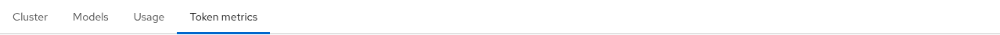
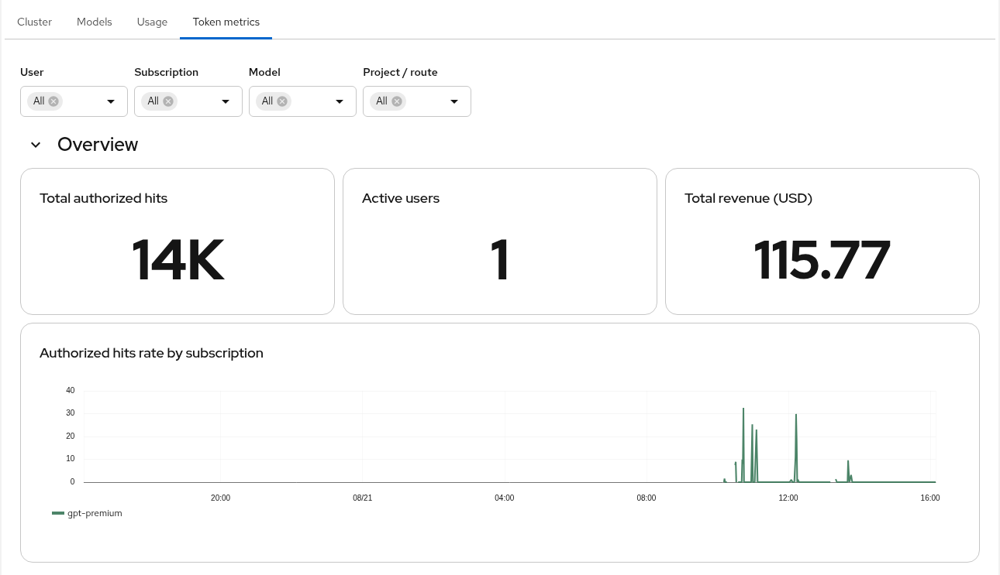
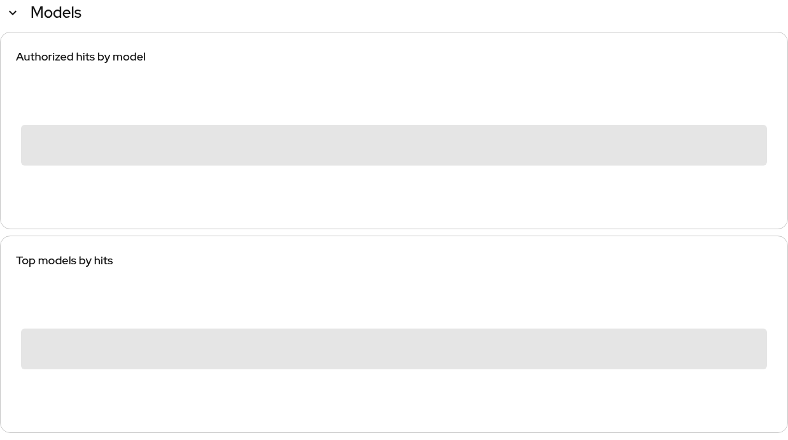

# MaaS Token metrics (Perses)

> This is a Perses adaptation of the Grafana dashboard created by **Guy Rakover**.
>
> Original dashboard: [rockocoop/openshiftai3 — maas/maas-monitoring](https://github.com/rockocoop/openshiftai3/tree/main/maas/maas-monitoring)

This directory adds a **Token metrics** tab to OpenShift AI **Observe and monitor → Dashboard (Tech Preview)**. The tab sorts after the product **Usage** tab. Apply the YAML with Kustomize. The UI lists any `PersesDashboard` whose name starts with `dashboard-`. Do not replace Usage (`dashboard-3-maas-usage-admin`), and do not open a PR against `odh-dashboard`.

Tested with:

- OpenShift AI 3.4
- Perses `perses.dev/v1alpha2` (`spec.config`)
- Kuadrant / Limitador (`authorized_hits`)

## Table of contents

- [About](#about)
- [Screenshots](#screenshots)
- [Manifests](#manifests)
- [Procedure](#procedure)
- [Filters](#filters)
- [Metrics](#metrics)
- [Dashboard panels](#dashboard-panels)
- [Cost rates](#cost-rates)
- [If panels are empty](#if-panels-are-empty)

## About

- Aimed at cluster admins who need hits, subscription, and demo cost for Model as a Service (MaaS) traffic on OpenShift AI.
- Metrics come from Limitador (`authorized_hits`), the same series Usage already queries. Grouping is by **subscription** (`MaaSSubscription` name), not Grafana `tier`.
- Demo USD rates live in a `PrometheusRule` (`maas:cost_rate`). Patch the rule to change prices; do not edit PromQL in every panel.
- Multi-tenant filter is **Project / route** (`limitador_namespace` = `{project}/{HTTPRoute}`). Do not name a variable `namespace` — OpenShift AI would bind the signed-in user’s projects, not the Limitador scrape.

## Screenshots

From a live OpenShift AI 3.4 cluster, time range **Last 24 hours**. After apply, admins see **Cluster**, **Models**, **Usage**, **Token metrics**.

Tab order:



Filters and Overview — total hits, active users, demo revenue, hits rate by subscription:



Users and subscriptions — hits over time, top users, top cost, hourly bars, totals by subscription:


Models — hits over time and top models:



## Manifests

| File | Kind | Namespace |
|---|---|---|
| `dashboard-4-maas-token-metrics-admin.yaml` | `PersesDashboard` | `redhat-ods-applications` |
| `maas-cost-rates.yaml` | `PrometheusRule` | `kuadrant-system` |

`limitador-servicemonitor.yaml` is an optional fallback scrape. It is not listed in `kustomization.yaml`. Do not apply it if Limitador is already scraped.

The UI lists every `PersesDashboard` whose name starts with `dashboard-` ([ODH observability dashboards guide](https://github.com/opendatahub-io/odh-dashboard/blob/main/docs/observability.md#observability-dashboards)). Do not replace `dashboard-3-maas-usage-admin`.

Complete the following steps in order. Apply the manifests only in step 4, after you confirm Limitador is already being scraped. If a Limitador scrape already exists, do not add another ServiceMonitor or PodMonitor.

## Procedure

### 1. Turn on the Dashboard page

```bash
oc get odhdashboardconfig odh-dashboard-config -n redhat-ods-applications \
  -o jsonpath='{.spec.dashboardConfig.observabilityDashboard}{"\n"}'
```

If that is not `true`:

```bash
oc patch odhdashboardconfig odh-dashboard-config -n redhat-ods-applications --type merge \
  -p '{"spec":{"dashboardConfig":{"observabilityDashboard":true}}}'
```

### 2. Use the same Prometheus datasource as Usage

This dashboard queries **`kuadrant-prometheus-datasource`** (RHOAI 3.4 Usage). Confirm:

```bash
oc get persesdatasource -n redhat-ods-applications
oc get persesdashboard dashboard-3-maas-usage-admin -n redhat-ods-applications \
  -o yaml | grep -i datasource | head
```

If Usage uses another name (for example `data-science-prometheus-datasource`), change every datasource `name` in `dashboard-4-maas-token-metrics-admin.yaml` to match before you apply.

### 3. Confirm Limitador `/metrics` is already scraped

Empty hit panels almost always mean Prometheus never saw `authorized_hits`.

```bash
oc get servicemonitor,podmonitor -A | grep -iE 'limitador|kuadrant'
oc get kuadrant -n kuadrant-system -o jsonpath='{.items[0].spec.observability}{"\n"}'
```

If `podmonitor/kuadrant-limitador-monitor` exists in `kuadrant-system`, or the series already exists in the User Workload Prometheus, **stop**. A second scrape duplicates series.

If scrape is missing, prefer Kuadrant observability:

```bash
oc patch kuadrant kuadrant -n kuadrant-system --type merge \
  -p '{"spec":{"observability":{"enable":true}}}'
```

Only if that stays off and there is still no monitor:

```bash
oc apply -f limitador-servicemonitor.yaml
```

That YAML has no `bearerTokenFile` (User Workload Monitoring rejects file-based tokens). Selector is `app: limitador`, port `http`, path `/metrics`.

### 4. Apply the dashboard and cost rule

From this directory:

```bash
oc apply -k .
```

### 5. Reload the UI

Open **Observe and monitor → Dashboard**. Admins should see **Cluster**, **Models**, **Usage**, **Token metrics**.

The CR name is `dashboard-4-maas-token-metrics-admin` so it sorts after `dashboard-3-maas-usage-admin`. If your Usage tab is not `dashboard-3-…`, rename this CR so the `dashboard-N-` prefix still sorts after it. The `-admin` suffix is the same Thanos access gate as Cluster and Usage.

Schema on RHOAI 3.4: `perses.dev/v1alpha2` with panels under `spec.config`.

## Filters

| Filter | Prometheus label | Purpose |
|---|---|---|
| User | `user` | Token identity |
| Subscription | `subscription` | `MaaSSubscription` name. Grafana grouped by `tier`; live MaaS does not |
| Model | `model` | Served model |
| Project / route | `limitador_namespace` | `{project}/{HTTPRoute}`, for example `beder/gpt-oss-20b-kserve-route` |

Do **not** add a dashboard variable named `namespace`. ODH substitutes the signed-in user’s OpenShift projects. Limitador’s scrape `namespace` is `kuadrant-system`, not the model project.

**All** on each filter uses `customAllValue: ".*"` so PromQL `=~"$var"` matchers stay valid.

## Metrics

Queries use untyped **`authorized_hits`** (same as Usage on RHOAI 3.4 + Limitador). If your Prometheus only has `authorized_hits_total`, replace `authorized_hits` in the dashboard YAML.

Rate-limit success/blocked (`authorized_calls` / `limited_calls`) stays on the **Usage** tab. Token metrics is hits, subscriptions, and demo cost.

## Dashboard panels

Type is how the panel is drawn: **stat** (single number), **timeseries** (line or bars), **table** (rows). A gray bar in a table is often one row that has not painted yet, or no series.

### Overview

| Panel | Type | Purpose |
|---|---|---|
| Total authorized hits | Stat | `sum(increase(authorized_hits[$__range]))` — hits in the selected window, not the raw counter |
| Active users | Stat | Distinct `user` labels on series that exist **now** (filters apply). Not limited to the selected time range |
| Total revenue (USD) | Stat | Hits in the window × `maas:cost_rate` per subscription. Subscriptions with no rate are omitted |
| Authorized hits rate by subscription | Timeseries | `rate(...[$__rate_interval])`, one series per subscription |

### Users and subscriptions

| Panel | Type | Purpose |
|---|---|---|
| Authorized hits by user and subscription | Timeseries | Hit **rate** over time, one series per `user` + `subscription` |
| Top 10 users by hits | Table | Ranking for the selected window (`increase` of hits) |
| Top 5 users by cost (USD) | Table | Same window, `increase(authorized_hits) * maas:cost_rate` |
| Hourly authorized hits by user | Timeseries (bars) | One bar per clock hour (`increase[1h]`, `minStep: 1h`). Not a trailing 1h rate. Use Last **6h** or **24h** — Last 1h is a single bar |
| Total authorized hits by subscription | Timeseries | `increase(...[$__range])` at each step (sliding window), one series per subscription. Looks stepped when traffic is bursty; not a running total from the start of the range |

### Models

| Panel | Type | Purpose |
|---|---|---|
| Authorized hits by model | Timeseries | Same sliding `increase([$__range])` as the subscription totals, one series per model |
| Top models by hits | Table | Ranking for the selected window |

## Cost rates

Prices are not hard-coded in panel PromQL. Cost panels join `increase(authorized_hits)` to `maas:cost_rate{subscription="<name>"}`.

A subscription with no `maas:cost_rate` series still appears in hit charts; it is omitted from revenue and cost.

Default in `maas-cost-rates.yaml`: `gpt-premium` = `0.008` USD per authorized hit (demo). List live names, then patch the rule — do not edit every panel.

```bash
oc get maassubscription -A
# or Prometheus: label_values(authorized_hits, subscription)
```

**Supported edit:** replace the full `spec.groups` list. Merge replaces that whole tree; copy every subscription you still want billed.

```bash
oc patch prometheusrule maas-cost-rates -n kuadrant-system --type merge -p "$(cat <<'EOF'
spec:
  groups:
  - name: maas-cost
    interval: 30s
    rules:
    - record: maas:cost_rate
      expr: vector(0.008)
      labels:
        subscription: gpt-premium
    - record: maas:cost_rate
      expr: vector(0.012)
      labels:
        subscription: acme-enterprise
EOF
)"
```

Wait about 30 seconds, then confirm on the same Prometheus that scrapes Limitador. If `wget` is missing in the pod, use the Thanos / User Workload query UI instead:

```bash
oc exec -n openshift-user-workload-monitoring prometheus-user-workload-0 -c prometheus -- \
  wget -qO- --post-data='query=maas:cost_rate' http://localhost:9090/api/v1/query
```

JSON patch of `rules/0` is **not** the supported path. That index is whatever happened to be first after the last merge. Replace the full list above.

Keep label `openshift.io/prometheus-rule-evaluation-scope: leaf-prometheus` or User Workload Monitoring will not evaluate the rule. Keep the object in `kuadrant-system` so Thanos `?namespace=kuadrant-system` (the Usage datasource) can see `maas:cost_rate`.

## If panels are empty

1. Scrape: no `authorized_hits` / `authorized_hits_total` in the datasource Prometheus. Re-run step 3.
2. Datasource name does not match Usage. Re-run step 2.
3. You are not in the `-admin` audience (need `prometheuses/api` like Usage).
4. Usage CR is not `dashboard-3-…`, so this tab sorted somewhere unexpected. Rename the Token metrics CR.
5. Cost tiles only: hits work, revenue is missing → no `maas:cost_rate` for that `subscription`. Patch the PrometheusRule (full `spec.groups` list).
6. Hourly chart is a single bar or looks empty → widen the time range to Last 6h or 24h.
